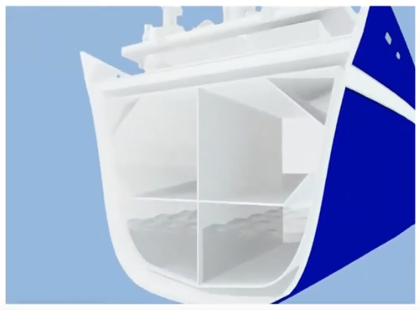
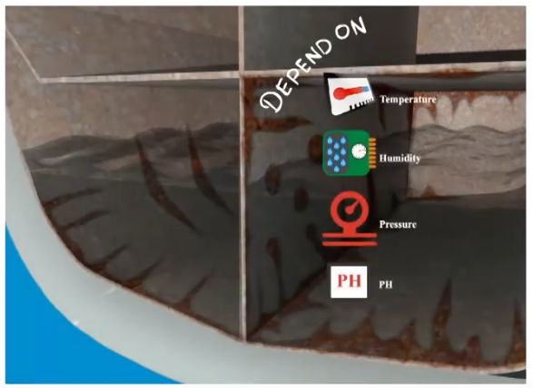
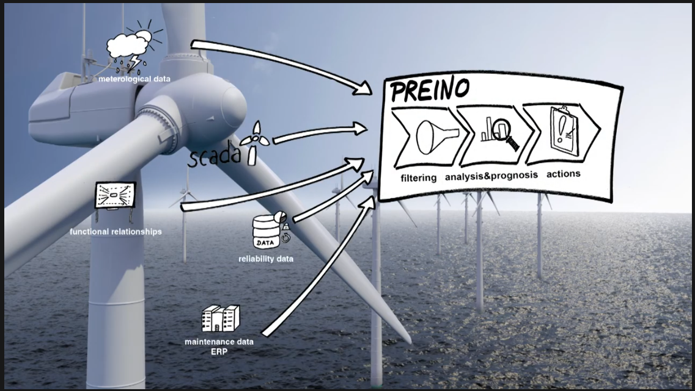
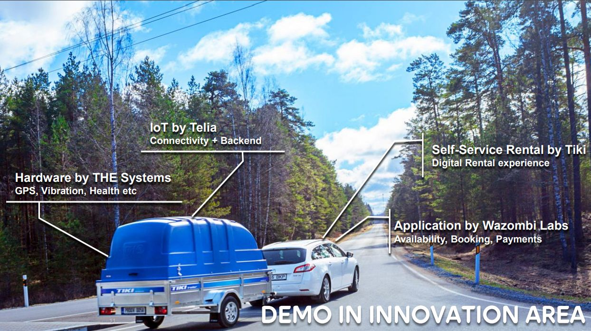

[<- back](./README.md)

## BIBA

### Bremer Institut für Produktion und Logistik 

- Scientific engineering research Institute and performs application-oriented and industrial research by facing technological and organisational challenges. 
- The conducted research projects are related to the scope of Industry 4.0. 
- ghr@biba.uni-bremen.de

### Maintenance 4.0: Preactive Maintenance
 - Optimize maintenance and service logistics by means of data  analysis.
 - integrate sensors in maintenance processes
 - data -> knowledge -> optimize maintenance proc. 
### Applications
 - __Ballast water tanks__. Assess corrosion state of critical components during operation. Extend operating life. 
 - Expertise to choose sensors for harsh environment.
 - Ability to extend system with sensors, without further effort 
  
  
 - __Off-shore wind turbines__; difficult access, expensive, logistics challenge; minimize physical inspection trips.
  

---

## [Industry 4.0 in Estonia](https://investinestonia.com/business-opportunities/industrial-automation/)

### Ericsson Estonia
- [Signed deal with ABB for a fully automated flexible robot cell solution in Tallinn 5G radio factory](https://www.ericsson.com/en/news/2019/4/ericsson-and-abb-5g-smart-manufacturing-estonia)
- "Enabled by 5G and ultra-low latency connectivity, smart manufacturing is widely expected to be deployed exponentially over the coming years"

### ABB
- __ABB Ability__:  remotely monitor, troubleshoot and optimize robot systems.
- "The ABB Ability Connected Services suite consists of five services: Condition Monitoring & Diagnostics, Backup Management, Remote Access, Fleet Assessment, and Asset Optimization (periodical analysis of a robot’s general health and performance)"
- [Olofsfors robot fleet case study](https://new.abb.com/news/detail/62166/forging-the-factory-of-the-future-for-olofsfors)
- [KOKI welding robot conencted for Condition Monitoring and Diagnostics](https://new.abb.com/news/detail/62166/forging-the-factory-of-the-future-for-olofsfors)
- __ABB Estonian branch__: motors and generators. 

### Nordic Automation Systems
- Manufacture of sensors, IoT Hub (client to access LoRaWAN gateways - ???)

### ITL
- Estonian Association of Information Technology and Telecommunications
- __Production Digitalisation__: co-application of different modern information technology solutions in production to increase revenue or decrease costs.
- __Doris Põld__: Estonian ICT Cluster manager, Industry 4.0 contact. {+372 511 4411, doris.pold@itl.ee}

#### [Pilot Projects](https://www.itl.ee/en/industry/)
- Estronics-Taltech collaboration. Smart product pilot projects with the aim of proving that it is possible to use digitalisation to change the business model in traditional industries. 
- __Ragnarok 2.0__: Work suit prototype. Speech recognition, GPS-positioning, fall detection, activity monitoring. Involved Protex Balti, textile company. Mobile application by Wazombi Labs (Tartu), monitoring with Ericsson Voyager (??).
  
- __Smart Trailer__: reserve and rent trailers via a mobile app, & monitor certain indicators of the trailer (what for??).
  